# llm-method-tester

**Benchmark how much retrieval strategy actually matters for local LLMs.**

[](../../actions/workflows/ci.yml)


Four ways of answering questions over a document corpus, three free open-source models, one
gold-standard dataset — every cell measured for answer quality, retrieval accuracy, latency, and
LLM-call cost, with results in a live dashboard.

<!-- HERO_SCREENSHOT -->

## The experiment

| | |
|---|---|
| **Models** | `gpt-oss:20b` · `nemotron-3-nano:4b` · `llama3.1:8b` (via [Ollama](https://ollama.com)) |
| **Strategies** | Baseline (no retrieval) · Traditional vector RAG · Obsidian-style RAG · PageIndex |
| **Corpus** | *Aurora Mesh* — a fictional distributed-config system: 13 technical docs + a 25-note Obsidian vault carrying the same facts |
| **Questions** | 30 gold-standard Q&As: single-hop, multi-hop, aggregation |
| **Metrics** | LLM-judge score (blind, 0–5) · keyword recall · retrieval hit rate · latency · tokens/sec · LLM calls per question |

**Why a fictional corpus?** Because no model can answer Aurora Mesh questions from pretraining,
the no-retrieval Baseline is a true control: every point a strategy scores above it is
attributable to retrieval, not memorization.

### The four strategies

1. **Baseline** — the model answers from its own knowledge. The control condition.
2. **Traditional RAG** — heading-aware chunking (~400 words, 50 overlap) → `nomic-embed-text`
   embeddings → [ChromaDB](https://www.trychroma.com/) cosine top-5 → context-stuffed prompt.
3. **Obsidian RAG** — retrieval that exploits vault *structure*: BM25 over weighted
   title/tags/body picks seed notes, then the strategy walks wikilinks **and backlinks** one hop
   out (score decay 0.5, shared-tag boost) — mimicking how a human hops through their vault.
   Retrieval is fully deterministic; the LLM only generates.
4. **PageIndex** — a faithful reimplementation of the vectorless, reasoning-based retrieval
   method from [VectifyAI/PageIndex](https://github.com/VectifyAI/PageIndex) (MIT): documents
   become TOC-like heading trees with LLM-written node summaries; at question time the model
   *reasons* over the tree outline to select sections, then descends one level to refine.
   Costs 2–3 LLM calls per question — and that cost is part of what the benchmark measures.

## Results

<!-- RESULTS_TABLE -->

*Run the benchmark yourself — results land in the dashboard and SQLite.*

## Quick start

Prerequisites: [uv](https://docs.astral.sh/uv/), Node 18.18+, [Ollama](https://ollama.com) ≥ 0.32.

```bash
git clone https://github.com/bwaugh/llm-method-tester
cd llm-method-tester
uv sync
ollama pull gpt-oss:20b && ollama pull llama3.1:8b && ollama pull nemotron-3-nano:4b && ollama pull nomic-embed-text
```

Run the full benchmark matrix (3 models × 4 strategies × 30 questions, then a judging pass):

```bash
uv run llm-bench run
```

Build the dashboard once, then serve everything from one process:

```bash
cd frontend && npm ci && npm run build && cd ..
uv run llm-bench serve
```

Open <http://localhost:8000>. From the dashboard you can launch runs, watch live progress, and
drill into any question to compare all twelve model×strategy answers side by side against the
gold answer.

### CLI

```text
uv run llm-bench run                 # full matrix + judge pass
uv run llm-bench run -m llama3.1:8b -s pageindex -q sh-01   # any subset
uv run llm-bench run --resume 3      # crash-safe: finished cells are skipped
uv run llm-bench serve               # API + dashboard on :8000
uv run llm-bench validate-corpus     # corpus integrity check
uv run llm-bench generate-corpus     # regenerate the corpus deterministically
```

## Architecture

```mermaid
flowchart LR
    subgraph corpus["corpus/ (committed, generated)"]
        docs["docs/ 13 markdown files"]
        vault["vault/ 25 linked notes"]
        qa["qa/questions.json 30 gold Q&As"]
    end

    subgraph strategies["RetrievalStrategy implementations"]
        B["Baseline"]
        T["Traditional RAG chunk → embed → Chroma"]
        O["Obsidian RAG BM25 → link graph"]
        P["PageIndex heading tree → LLM traversal"]
    end

    R["BenchmarkRunner model-major matrix, resume, deferred judge pass"]
    E["Evaluator keyword recall · hit rate + blind LLM judge"]
    S[("SQLite runs / results")]
    A["FastAPI /api/*"]
    F["React dashboard"]
    OL["Ollama gpt-oss · nemotron · llama3.1 · nomic-embed"]

    corpus --> strategies
    strategies --> R --> E --> S --> A --> F
    strategies -.->|LLMClient / EmbeddingClient| OL
    E -.->|judge| OL
```



Every LLM/embedding access goes through injectable `LLMClient` / `EmbeddingClient` ABCs
([src/llm_bench/llm/base.py](src/llm_bench/llm/base.py)) — the whole test suite and CI run on
deterministic fakes, no GPU or Ollama required.

Design decisions worth knowing:

- **Model-major matrix order** — the runner iterates model → strategy → question so the GPU
  swaps models three times per run instead of hundreds.
- **Deferred judging** — the judge model (`gpt-oss:20b`) grades *after* the whole matrix
  finishes, in one batch, for the same reason. The judge is blind: it sees question, gold
  answer, expected facts, and candidate — never which model or strategy answered.
- **Crash-resumable runs** — every cell writes to SQLite immediately; per-cell failures land in
  the row's `error` column instead of killing the run; `--resume` skips finished cells.
- **Fair hit-rate scoring** — each strategy declares which corpus representation it retrieves
  from (`docs`, `vault`, or none), and is scored against that representation's gold sources.
- **Index caching** — Chroma collections and PageIndex summaries are keyed by corpus hash (and
  model, for summaries), so repeat runs skip index building.

## Repository layout

```text
corpus/                 # committed benchmark corpus (regenerate: llm-bench generate-corpus)
src/llm_bench/
  llm/                  # LLMClient/EmbeddingClient ABCs, Ollama impl, test fakes
  corpus/               # doc loader, Obsidian vault parser + link graph, QA schema
  strategies/           # baseline, traditional_rag, obsidian_rag, pageindex
  eval/                 # metrics, blind judge, evaluator
  storage/              # SQLite repository
  runner.py             # matrix orchestration
  api/ + cli.py         # FastAPI app + typer CLI
frontend/               # React 18 + Vite + Tailwind dashboard (vitest + msw)
tests/                  # 150+ tests, all on fakes — no GPU needed
```

## Development

Backend (Python 3.12, [uv](https://docs.astral.sh/uv/)):

```bash
uv run pytest            # 80% coverage gate enforced
uv run ruff check .
uv run pytest -m live    # optional smoke tests against a running Ollama
```

Frontend:

```bash
cd frontend
npm run dev              # Vite dev server, proxies /api to :8000
npm test                 # vitest + Testing Library + msw
npm run lint && npm run typecheck
```

CI runs lint, type checks, and both test suites (backend on Ubuntu **and** Windows) on every
push; the backend enforces ≥80% coverage (currently ~97%).

### Windows notes

- Store models on a big drive: set `OLLAMA_MODELS` (e.g. `D:\ollama-models`) as a *user*
  environment variable and fully restart Ollama. If Ollama later reports "model not found"
  for models you have, the server was restarted without the env var and fell back to `C:`.
- Runtime artifacts (results DB, index caches) default to `%LOCALAPPDATA%\llm-method-tester`,
  not the repo — OneDrive sync locks SQLite files mid-write. Override with `LLM_BENCH_CACHE_DIR`.

## Configuration

All settings are env-overridable with the `LLM_BENCH_` prefix (or a `.env` file):

| Variable | Default | |
|---|---|---|
| `LLM_BENCH_OLLAMA_BASE_URL` | `http://localhost:11434` | Ollama endpoint |
| `LLM_BENCH_MODELS` | the three benchmark models | JSON list |
| `LLM_BENCH_JUDGE_MODEL` | `gpt-oss:20b` | blind judge |
| `LLM_BENCH_EMBEDDING_MODEL` | `nomic-embed-text` | vector RAG embeddings |
| `LLM_BENCH_CACHE_DIR` | `%LOCALAPPDATA%\llm-method-tester` | DB + index caches |
| `LLM_BENCH_CORPUS_DIR` | `corpus` | benchmark corpus root |

## Acknowledgements

- **[PageIndex](https://github.com/VectifyAI/PageIndex)** by VectifyAI (MIT) — the vectorless
  reasoning-retrieval method reimplemented here as the `pageindex` strategy.
- **[Ollama](https://ollama.com)** for making local models this easy.
- gpt-oss (OpenAI), Nemotron (NVIDIA), and Llama (Meta) — the open-weight models under test.

## License

MIT
