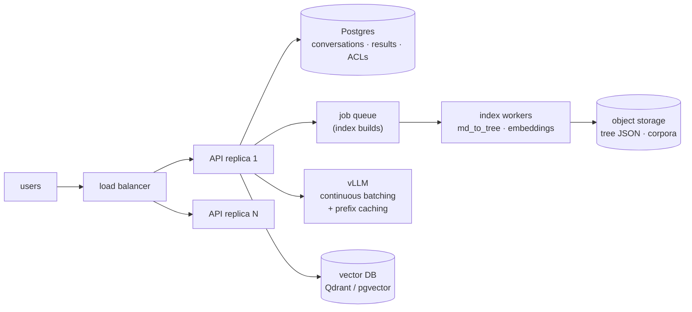

# Scaling the four retrieval strategies to production

This document analyzes what happens to each retrieval strategy when it leaves the benchmark
harness and has to serve **dozens to hundreds of concurrent users**. Every number cited here is
measured from the committed reference run ([results/reference-run.json](../results/reference-run.json):
3 models × 5 strategies × 30 questions, zero errors) on the benchmark corpus (13 docs / 52 KB
source). Where the corpus is small enough to hide a scaling effect, that is called out explicitly.

## Measured per-query economics

Averages across all three models on the reference run:

| Strategy | Prompt tok/query | Completion tok/query | LLM calls | Latency | Judge score | Index on disk |
|---|---:|---:|---:|---:|---:|---:|
| Baseline (control) | 76 | 511 | 1 | 30.1s¹ | 0.23 | 0 |
| Vector RAG | 562 | 76 | 1 | **2.2s** | 4.58 | 1,038 KB² |
| Obsidian RAG | 1,026 | 87 | 1 | 2.8s | 4.56 | 0³ |
| PageIndex (reimpl) | 4,623 | 632 | 3 | 16.4s | **4.74** | 106 KB |
| PageIndex (official) | **11,040** | 388 | 2 | 15.5s | 4.33⁴ | 199 KB |

¹ Baseline latency is inflated by reasoning models thinking hard about unanswerable questions —
itself a finding: models burn the most tokens when they know the least.
² Chroma (HNSW + embeddings): **20× the source corpus size**. ³ Obsidian RAG builds BM25 +
link graph in memory at startup (~instant for this corpus). ⁴ Dragged down by the 4B model
(3.37); on gpt-oss/llama the official code scores 4.8+.

The headline economics: **official PageIndex spends ~20× the prompt tokens of vector RAG per
query** because the entire tree index rides in every prompt. That single fact drives most of
the scaling analysis below.

---

## Strategy-by-strategy analysis

### Vector RAG (chunk → embed → ChromaDB → top-k)

- **Cost.** Cheapest per query by an order of magnitude: ~560 prompt + ~76 completion tokens,
  one LLM call, plus one embedding call (~10ms on a local model, fractions of a cent hosted).
  Index-build cost is one embedding pass over the corpus — linear, cheap, and incremental
  (new document → embed only its chunks).
- **Long-term storage.** The heavyweight: embeddings are ~20× source size here and grow
  linearly with corpus. Worse, the index is **married to its embedding model** — change or
  deprecate `nomic-embed-text` and you re-embed everything. Plan for periodic full re-index
  as embedding models improve; keep raw text as the source of truth, treat vectors as a
  rebuildable cache.
- **Token usage.** Constant per query regardless of corpus size (top-k is fixed). This is the
  only strategy whose token bill does not grow with the corpus.
- **Query speed.** Fastest measured (0.8–4.4s by model; 2.2s mean). ANN search is
  sub-millisecond at this scale and stays low-millisecond into the millions of chunks.
- **Answer quality.** 4.58 mean judge, best retrieval hit rate (88%) in the benchmark. Weakest
  on questions whose phrasing shares no vocabulary/semantics with the relevant chunk, and on
  multi-source aggregation (top-k caps how many distinct sources can contribute).
- **Biggest limiting factor.** Embedding-model coupling and retrieval quality ceiling: similarity
  search cannot *reason* about what it's looking for. Chunking also destroys document structure —
  a fact split across a chunk boundary is retrievable only by luck of the overlap window.
- **Horizontal vs vertical.** The best horizontal scaler. The vector store shards; the API tier
  is stateless; embedding is trivially parallel. Replace in-process Chroma with a server-mode
  vector DB (Qdrant, pgvector) the moment you have a second API replica — in-process indexes
  and horizontal replicas don't mix.

### Obsidian RAG (BM25 + wikilink/backlink graph traversal)

- **Cost.** Near-zero retrieval cost: BM25 and graph hops are pure CPU, no embedding calls
  ever. One LLM call per query (~1,000 prompt tokens — link expansion pulls in whole notes,
  so context is ~2× vector RAG's).
- **Long-term storage.** Effectively free — the "index" *is* the vault. BM25 postings and the
  link graph rebuild from source in milliseconds-to-seconds and can live in memory or a tiny
  serialized sidecar. No model coupling at all: the index never rots when you switch LLMs.
- **Token usage.** Constant per query (top-6 notes cap). Grows only if you raise the note cap
  or your notes grow.
- **Query speed.** 2.8s mean, within noise of vector RAG. Retrieval itself is microseconds;
  it's all generation time.
- **Answer quality.** 4.56 mean — statistically tied with vector RAG on this corpus, achieved
  with zero ML in the retrieval path. The link graph is what earns this: pure BM25 would miss
  the multi-hop questions that graph expansion recovers.
- **Biggest limiting factor.** **Curation is the index.** The method's quality is a function of
  how well the vault is linked and tagged — it inherits the discipline of whoever maintains
  the notes. On an unlinked dump of documents it degrades to plain BM25. This is a human
  scaling limit, not a technical one, and it's the hardest kind to fix with hardware.
- **Horizontal vs vertical.** Scales horizontally without drama (replicate the in-memory index
  per API replica; rebuild on vault change via a pub/sub invalidation). Vertical scaling is
  irrelevant — retrieval load is negligible. All real capacity planning is generation capacity.

### PageIndex — both variants (tree index + LLM reasoning traversal)

- **Cost.** The expensive one. The official flow puts the whole ~11k-token tree in every
  query's first call; the reimplementation halves that (~4.6k across 3 calls) by capping the
  first-pass outline depth. At hosted-API prices, official PageIndex costs roughly **20× vector
  RAG per query**; self-hosted, it costs you throughput instead (a 12k-token prefill occupies
  the GPU ~10× longer than a 600-token one). Index-build cost is also the highest: one summary
  call per node (~174 nodes), **per model** if you let each model write its own summaries.
- **Long-term storage.** Excellent — the best of any method. Trees are 2–4× source size,
  human-readable JSON, diffable in git, auditable, and **model-agnostic to read** (any LLM can
  traverse any tree). Summaries are the only model-flavored part, and pinning one summarizer
  model makes trees shareable artifacts. This is the strategy whose index you could email to
  another organization (see the cross-org note below).
- **Token usage.** **Grows linearly with corpus size** — this is the structural difference from
  the other methods. Every document added to the corpus makes *every future query* more
  expensive, because the tree outline rides in the prompt. At ~13 documents we're at 11k
  tokens; a few hundred documents of this shape would exceed every local context window.
- **Query speed.** 15–16s mean, up to ~9× vector RAG on the same model — 2–3 sequential LLM
  calls can't be parallelized (each depends on the previous), so latency floors are high.
- **Answer quality.** The best in the benchmark on capable models: 5.00 (reimpl) and 4.83
  (official) on gpt-oss, with the official code hitting **95% retrieval hit rate** — the
  single best retrieval result measured. It also degrades most sharply with model size: the
  4B nemotron dropped to 3.37 on the official single-pass flow while holding 4.70 on the
  staged reimplementation. **Method structure substitutes for model capability.**
- **Biggest limiting factor.** The context window — and it **fails silently**. We measured
  this directly: nemotron tokenized the pretty-printed tree past 16k, Ollama truncated the
  *question* out of the prompt, and the model confidently answered a question it invented,
  scoring 0.33 with zero errors reported. Any production deployment needs (a) token counting
  against the actual model tokenizer before every search call, and (b) a hard failure instead
  of silent truncation.
- **Horizontal vs vertical.** Leans **vertical** at the model tier: quality wants the biggest
  model you can afford, and long prefills want fast GPUs with big KV caches. But two techniques
  restore horizontal economics:
  1. **Prefix caching** — the tree outline is a static shared prefix across all queries on the
     same corpus. vLLM's automatic prefix caching (or hosted prompt caching) makes the 11k-token
     prefill nearly free after the first query. This single optimization collapses most of the
     20× cost gap and is the highest-leverage change for serving PageIndex at scale.
  2. **Hierarchical descent** — past a few dozen documents, stop stuffing all trees into one
     prompt. Route first over document descriptions, then descend into 1–3 trees (this is
     exactly what the upstream project's agentic mode does with its `get_document_structure`
     tool, and what the reimplementation's two-stage outline approximates). Token cost then
     grows with *answer complexity*, not corpus size.

### Baseline (no retrieval)

Included only as the control, but it teaches one scaling lesson worth keeping: it was the
*slowest* strategy measured (30–48s) because models generate the most tokens when they have
the least grounding. Ungrounded fallback paths in production are not just wrong — they're
expensive and slow while being wrong.

---

## Serving architecture for dozens-to-hundreds of users

The benchmark harness is deliberately single-slot (one GPU, one run at a time). A serving
deployment reuses the same strategy code behind a different spine:

Concrete moves, in order of leverage:

1. **Replace Ollama with vLLM** for serving (keep Ollama for local dev). Continuous batching
   turns one 24GB GPU into ~20–50 concurrent request streams for the 4B/8B models. The
   strategies already speak to an injectable client — only `wiring.py` changes.
2. **Turn on prefix caching** before anything else if PageIndex is in the mix (see above).
3. **SQLite → Postgres** at the second API replica; SQLite's single-writer model is the
   benchmark's friend and a fleet's enemy. The `ResultsRepository` interface is the seam.
4. **Move index building off the request path.** Tree builds take minutes per corpus; embedding
   passes take seconds-to-minutes. Queue them; serve stale-until-rebuilt.
5. **Route by question difficulty.** Vector RAG answers 88% of lookups at 1/20th the cost;
   escalate to PageIndex when retrieval confidence is low or the question is multi-source.
   A two-tier router captures most of PageIndex's quality at a fraction of its cost.
6. **Capacity math** (order-of-magnitude, self-hosted 8B on one 24GB GPU with vLLM):
   vector RAG at ~640 tok/query ≈ thousands of queries/hour; official PageIndex uncached at
   ~11.4k tok/query ≈ low hundreds/hour; PageIndex with prefix caching ≈ 1–2k/hour. Divide
   user counts by your peak queries-per-user-hour to size the fleet.

## Conversations and cross-organization sharing

- **Stored conversations** are retrieval-agnostic: a `conversations`/`messages` schema in
  Postgres (this repo's results table is already 80% of a chat log — question, answer, sources,
  timestamps). History goes into the generation prompt only; retrieval stays per-turn. The
  vendored upstream code even accepts `chat_history` in its completion helper.
- **Cross-org document sharing favors the vectorless method.** A PageIndex tree is a portable,
  inspectable JSON artifact: org A can share a summaries-only tree without shipping raw
  documents, org B queries it with any model they trust. Vector indexes can't cross a trust
  boundary as cleanly — embeddings are opaque, model-coupled, and vulnerable to inversion.
  The enforcement point is retrieval-time filtering: per-org namespaces and per-document ACLs
  decide which trees (or which subtrees) are allowed into a caller's search prompt, and the
  node-id traceability gives you an audit log of exactly what was read.

## Decision matrix

| If you need… | Pick | Because |
|---|---|---|
| High QPS, low cost, good-enough answers | Vector RAG | constant tokens/query, fastest, shards horizontally |
| Zero-infra retrieval over curated notes | Obsidian RAG | free index, no model coupling, quality rides on curation |
| Maximum answer quality, auditable retrieval | PageIndex + big model | best judge scores + 95% hit rate, node-level traceability |
| Small models at the edge | PageIndex (staged descent) | method structure compensates for model size (4.70 vs 3.37) |
| Cross-org index sharing | PageIndex trees | portable, inspectable, model-agnostic JSON |
| A silent-failure-free system | token counting + hard limits | the context window fails silently — we measured it |
