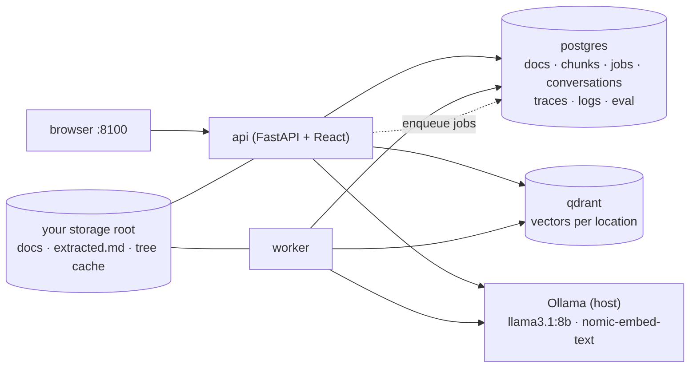

# pageindex-test

**Test the staged-retrieval architecture on *your own* documents.**

A production-shaped prototype of the pipeline recommended in
[docs/scaling.md](../docs/scaling.md): **hybrid recall** (BM25 + vectors, rank-fused) narrows
your library to a handful of documents, an optional **PageIndex precision stage** reasons over
their heading trees to pick exact sections, and every answer arrives **cited to the section**
with a full pipeline trace you can mine for metrics.

Built to answer one question with data instead of vibes: *what does reasoning-based retrieval
buy on my documents, and what does it cost?* The Eval tab measures exactly that.

## What's in the box

| | |
|---|---|
| **Chat** | Ask questions over your library; answers cite document sections; every message links to its pipeline trace; per-question toggle for the PageIndex stage |
| **Documents** | Drag-drop upload or bulk-import a folder; PDF (TOC-aware), Markdown, TXT; scanned PDFs are flagged `unsupported` with the reason — never silently empty |
| **Eval** | Build gold Q&A sets (manual or LLM-generated with human approval), then run **staged vs hybrid-only** over the same questions: keyword recall, retrieval hit rate, and a blind LLM judge, side by side |
| **Logs** | Structured JSON logs persisted to Postgres, filterable in-app (level / component / text / trace), with a per-query **stage waterfall** (timings, candidates, tokens) |
| **Settings** | Pick where your data lives — desktop, external drive, any mounted root — and switch between independent per-location libraries |

## Architecture



Query pipeline per question: `bm25 → vector → fusion → [tree_build → tree_select] → answer` —
each stage timed and logged into a `query_traces` row.

The backend reuses the benchmark's building blocks as a library (`llm_bench`): the Ollama
clients, heading-aware chunker, PageIndex tree builder, metrics, and blind judge — the exact
code the [main benchmark](../README.md) validated.

## Quick start

Prerequisites: Docker Desktop (WSL2 backend), host [Ollama](https://ollama.com) with
`llama3.1:8b`, `nomic-embed-text`, and (for eval judging) `gpt-oss:20b` pulled.

```bash
cd pageindex-test
copy .env.example .env
# edit .env: set PIT_ROOT_0 to where you want data stored, e.g.
#   PIT_ROOT_0=C:\Users\you\pageindex-data     (desktop)
#   PIT_ROOT_1=E:\pageindex-data               (external drive, optional)
docker compose up -d --build
```

Open <http://localhost:8100>. The sidebar's health dots confirm Postgres, Qdrant, and Ollama
connectivity before you start.

1. **Documents** → drop in a few PDFs/Markdown files → watch them turn `ready`
2. **Chat** → ask something only your documents know → check the citations
3. **Eval** → create a set → *Generate from documents* → approve the good questions →
   *Run staged vs hybrid* → compare the tiles
4. **Logs** → paste a trace id from any answer → read the stage waterfall

Both containers use `restart: unless-stopped` — the stack survives power loss and reboots.

## Choosing where data lives

Docker containers can only see paths you mount, so storage selection is two-step by design:

1. List candidate roots in `.env` (`PIT_ROOT_0`, `PIT_ROOT_1`) — each becomes a bind mount
2. Pick the **active** location in Settings, which shows real free space per root

Each location keeps an independent library (`<root>/.pageindex-test/`: original + extracted
documents, tree caches) and its own Qdrant collection and database rows. Switching locations
swaps libraries; nothing is migrated or lost. An unplugged external drive shows as
`unavailable` instead of crashing.

Postgres and Qdrant data stay in named Docker volumes — never bind-mounted to NTFS, which
corrupts under sync/9p semantics. Only your documents and human-readable tree JSON live on
your chosen drive.

## Reading a trace (the future metrics source)

Every question writes one `query_traces` row:

```json
{
  "pipeline": "staged",
  "stages": [
    {"name": "bm25",        "ms": 4,    "candidates": 16},
    {"name": "vector",      "ms": 38,   "candidates": 16},
    {"name": "fusion",      "ms": 0,    "candidates": 8},
    {"name": "tree_build",  "ms": 11,   "candidates": 42, "detail": {"docs": ["…"]}},
    {"name": "tree_select", "ms": 2900, "tokens": 3100, "detail": {"selected": […], "reasoning": "…"}},
    {"name": "answer",      "ms": 2100, "tokens": 1450}
  ],
  "prompt_tokens": 4210, "completion_tokens": 340, "llm_calls": 2
}
```

That row answers the production questions directly: where latency goes, what each stage
contributes, what the precision stage costs in tokens, and how often it falls back
(`tree_fallback` stages carry the reason). SQL over `query_traces` + `logs` is the intended
metrics path:

```sql
-- avg latency and token cost by pipeline variant
SELECT pipeline, count(*), round(avg(total_ms)) AS avg_ms,
       round(avg(prompt_tokens + completion_tokens)) AS avg_tokens
FROM query_traces GROUP BY pipeline;
```

## Design decisions worth knowing

- **Trees are built lazily per retrieved document and cached by content hash** — token cost
  tracks answer complexity, not corpus size (the scaling doc's hierarchical-descent design).
- **The context window fails loudly.** The benchmark measured Ollama silently truncating
  over-budget prompts (a model confidently answered a question it invented). Here an
  over-budget outline triggers a `tree_fallback` stage recorded in the trace, and the answer
  comes from hybrid retrieval instead.
- **Structured output never uses Ollama's grammar mode** (it returns empty responses on
  reasoning models); JSON is prompt-instructed and parsed leniently.
- **Eval judging is deferred and blind**: all answers first, then the judge model in one
  batch (one model swap, not one per question), seeing only question + expected facts +
  candidate.
- **Generated gold questions require human approval**, and every generated keyword group is
  verified to literally appear in the source document before it's kept.
- **BM25 rebuilds from Postgres per query** — milliseconds at prototype scale, and the API
  never serves a stale lexical index after the worker ingests. Swap for a server-mode engine
  behind the `LexicalIndex` protocol when the corpus outgrows it.

## Windows notes

- **Host Ollama from Docker**: the compose file reaches it via `host.docker.internal`. If the
  ollama health dot is red: run `setx OLLAMA_HOST 0.0.0.0`, restart Ollama, and allow inbound
  port 11434 for the WSL interface if Windows Firewall asks.
- **External drives** must be visible to Docker Desktop file sharing; removable drives that
  vanish show as `unavailable` in Settings.
- Prefer the self-contained option? `docker compose --profile local-ollama up -d` and set
  `PIT_OLLAMA_BASE_URL=http://ollama:11434` in `.env` (GPU passthrough preconfigured; pull
  models inside with `docker compose exec ollama ollama pull …`).

## Development

```bash
cd pageindex-test/backend
uv sync
uv run pytest          # ~100 tests on fakes + SQLite; 80% coverage gate
uv run ruff check .

cd ../frontend
npm install
npm test               # vitest + Testing Library + msw
npm run dev            # Vite dev server proxying /api to :8100
```

No test touches Docker, Postgres, Qdrant, or a GPU — the same discipline as the parent repo.
CI runs backend (Ubuntu + Windows), frontend, and a full image build on every push.

## Configuration reference (.env / PIT_* env vars)

| Variable | Default | |
|---|---|---|
| `PIT_ROOT_0` / `PIT_ROOT_1` | — | host storage roots (0 required) |
| `PIT_OLLAMA_BASE_URL` | `http://host.docker.internal:11434` | Ollama endpoint |
| `PIT_DEFAULT_MODEL` | `llama3.1:8b` | answering model (changeable in Settings) |
| `PIT_JUDGE_MODEL` | `gpt-oss:20b` | eval judge |
| `PIT_EMBEDDING_MODEL` | `nomic-embed-text` | vector embeddings |
| `PIT_HYBRID_TOP_N` | `8` | fused chunks entering the context |
| `PIT_TREE_STAGE_DOCS` | `4` | docs whose trees enter the precision stage |
| `PIT_TREE_NUM_CTX` | `16384` | context window for tree selection |
| `PIT_LOG_RETENTION_DAYS` | `30` | log table pruning window |
